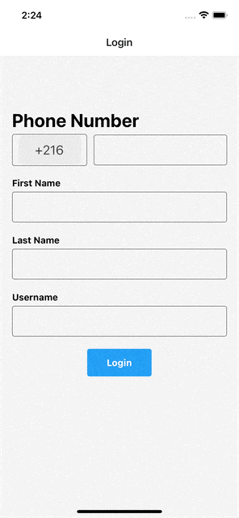

# React Native Telegram UI Clone

EN - This project is the third assignment within the scope of "Akbank React Native Bootcamp" organized by Patika.dev. It includes the interface design of the main screen, chat screen, setting screen and login screen of the Telegram application.

TR - Bu proje Patika.dev 'in düzenlediği "Akbank React Native Bootcamp" kapsamında yapılan üçüncü ödevdir. Telegram uygulamasının arayüz tasarımını içermektedir.
<br/><br/>

## Screenshot APP

<div style="display:flex; flex-direction:row; margin-right:20px;">

</div>
<br/>
<br/>

## Technologies


<br/>
<br/>

### Features

- Login Screen
- Chat Screen
- Contact Screen
- Setting Screen
- Supports dark/light mode 🌗

### Todo

- Listing of chats
- Add contact screen
- New additional features to the settings page

## Installation

```
npm install
npm run ios
npm run android
```

<br/>
<br/>
